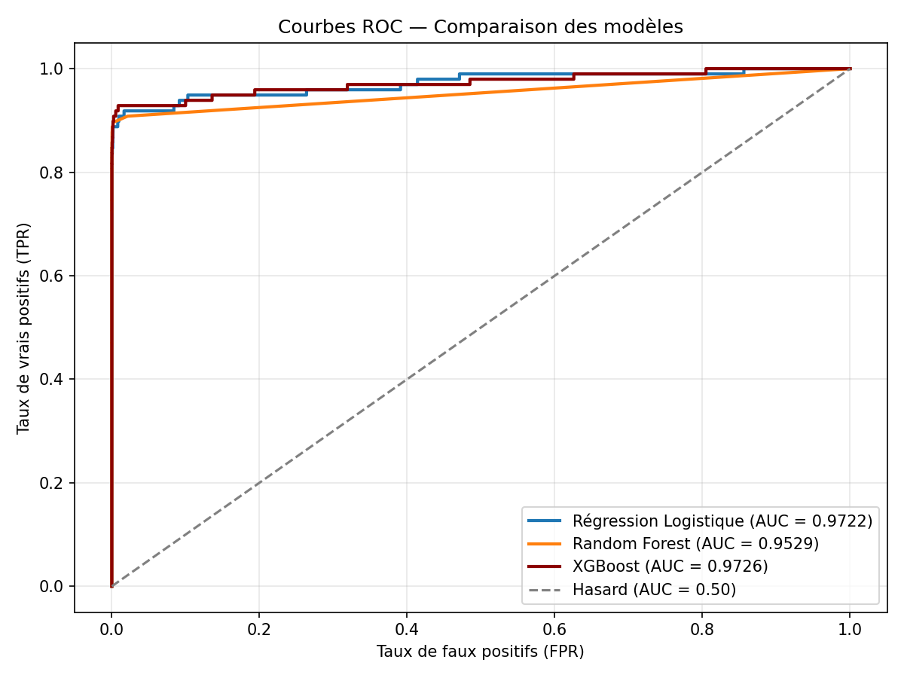
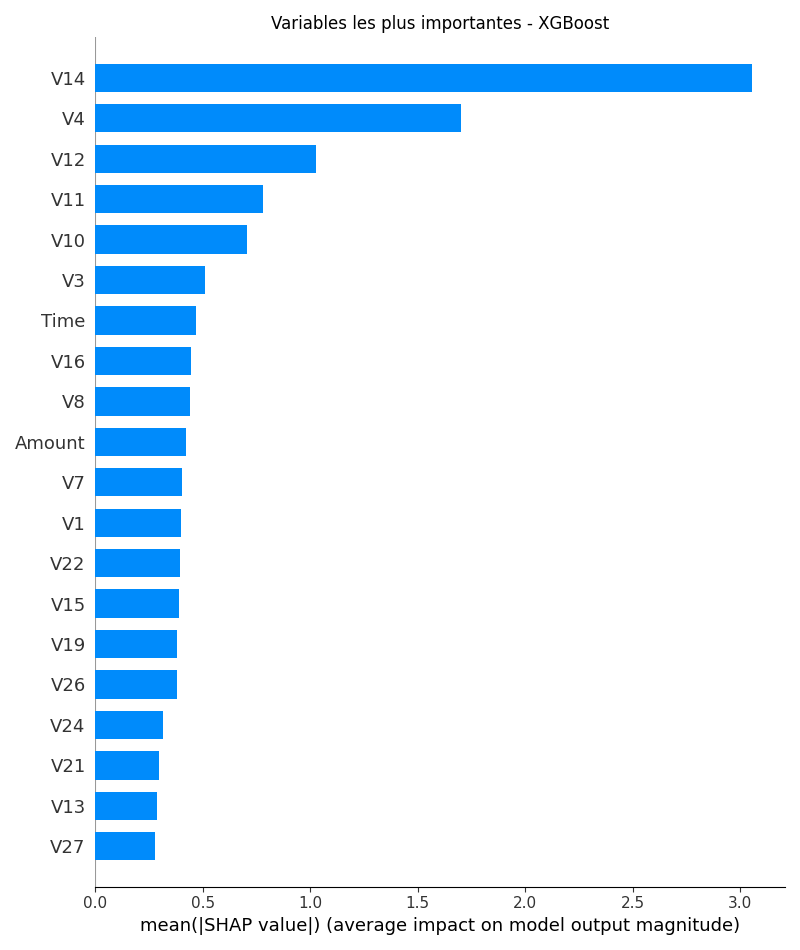

# Credit Card Fraud Detection

A complete data analysis and machine learning project detecting fraudulent credit card transactions, built as part of a Business Analyst portfolio.

## 📊 Overview

Credit card fraud represents a major financial risk for banks and merchants. This project analyzes **284,807 transactions** (492 fraudulent, ~0.17%) from the [Kaggle Credit Card Fraud Detection dataset](https://www.kaggle.com/mlg-ulb/creditcardfraud), combining SQL analysis, an interactive Power BI dashboard, and a comparison of three machine learning models to detect fraud effectively.

**Key result:** fraudulent transactions account for only **€60,128** out of **€25.1M** in total transaction volume — but detecting them accurately and early is critical to limiting financial damage.

## 🔍 Key Insights (SQL Analysis)

- **Time of day matters:** fraud rates are highest during the **00h–06h** window, likely because legitimate transaction volume drops at night, making fraud proportionally more visible.
- **Amount matters:** fraud is concentrated at the extremes — **very high amounts (>€500)**, where the payoff is largest, and **very low amounts (<€10)**, often used to test stolen card validity.
- **Financial impact:** fraud represents roughly **0.24%** of total transaction value, despite being only 0.17% of transaction count — fraudulent transactions tend to involve higher amounts on average.

See [`notebooks/sql/01_exploration.sql`](notebooks/sql/01_exploration.sql) for the full SQL analysis.

## 📈 Power BI Dashboard

An interactive dashboard summarizing the key metrics:

- Total transactions: **284,807**
- Fraud detected: **492**
- Global fraud rate: **0.17%**
- Fraud rate by time of day (%)
- Fraud rate by amount range (%)

File: [`dashboard/dashboard_fraude.pbix`](dashboard/dashboard_fraude.pbix)

## 🤖 Machine Learning: Model Comparison

Three classification models were trained and compared to find the best trade-off between catching fraud (recall) and avoiding false alarms (precision):

| Model | AUC-ROC | Precision | Recall | F1-score |
|---|---|---|---|---|
| Logistic Regression | 0.9722 | 0.061 | 0.918 | 0.114 |
| Random Forest | 0.9529 | 0.961 | 0.745 | 0.839 |
| **XGBoost** | **0.9726** | 0.871 | 0.827 | **0.848** |

**Why XGBoost:** Logistic Regression catches almost all fraud but drowns analysts in false positives (6% precision). Random Forest is very reliable but misses 1 in 4 fraud cases. **XGBoost offers the best overall balance**, catching 83% of fraud while keeping false alarms manageable — the highest F1-score of the three.



Model interpretability was explored using **SHAP** to identify which features drive fraud predictions:



## 🗂️ Project Structure

```
fraud-detection-project/
├── dashboard/
│   ├── dashboard_fraude.pbix      # Power BI dashboard
│   └── data_powerbi.csv           # Enriched data feeding the dashboard
├── notebooks/
│   ├── sql/
│   │   └── 01_exploration.sql     # SQL queries used for analysis
│   ├── 01_exploration.ipynb       # Initial data exploration
│   ├── 02_sql_analysis.ipynb      # SQL-based analysis (SQLite)
│   └── 03_machine_learning.ipynb  # Model training, comparison, SHAP
├── reports/                       # Generated charts (PNG)
├── requirements.txt
└── README.md
```

## 🛠️ Tech Stack

- **Python**: pandas, numpy, matplotlib, seaborn
- **Machine Learning**: scikit-learn (Logistic Regression, Random Forest), XGBoost, SHAP
- **Database**: SQLite
- **Visualization**: Power BI

## 🚀 How to Run

1. Clone this repository
2. Download the dataset from [Kaggle](https://www.kaggle.com/mlg-ulb/creditcardfraud) and place `creditcard.csv` at the project root
3. Install dependencies:
   ```bash
   pip install -r requirements.txt
   ```
4. Run the notebooks in order: `01_exploration.ipynb` → `02_sql_analysis.ipynb` → `03_machine_learning.ipynb`

## 📬 Contact

Feel free to reach out if you have questions about this project or want to discuss Business Analyst / Data opportunities.